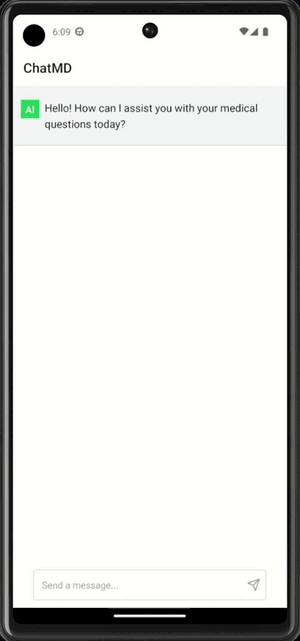
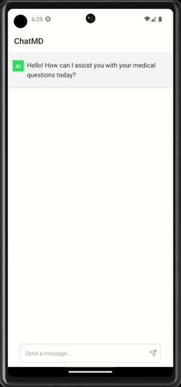
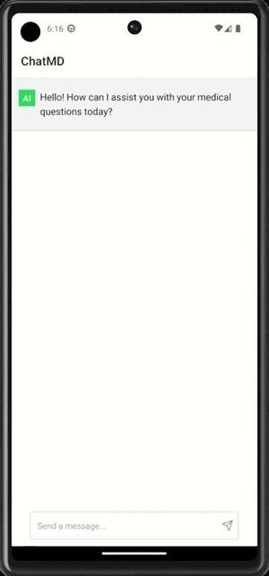

# ChatMD-Demo

Demo ChatMD application for Innovation and Entrepreneurship class. Uses gpt-3.5-turbo and implements streaming. Express.js for the server and Expo with NativeBase for the app.

ChatMD is an app designed to assist with medical issues and reduce unnecessary visits to the emergency room. It can provide personalized health suggestions and information related to the user’s personal situation. **This application is for demo purposes only and is NOT medical advice.**

When possible and appropriate, ChatMD suggests that the user should visit a clinic instead of an emergency room. This can reduce emergency room wait times and the load on the medical system, saving both time and money. Importantly, when a symptom could be a sign of a serious medical condition, such as appendicitis as shown below, ChatMD stresses the importance of seeking medical attention immediately. This can result in better outcomes for patients by seeking medical attention earlier than they otherwise would.

# Examples

## Fever

Example response to a question relating to fever. ChatMD informs the user that the current fever is not an emergency situation, but other symptoms could warrant immediate attention. It also provides suggestions on dealing with the situation, such as taking over-the-counter medication like ibuprofen.

## Abdomen pain

Example response to a question relating to abdominal pain. ChatMD informs the user sudden abdominal pain can be a sign of several conditions including appendicitis and stresses the importance of seeking medical attention as soon as possible. It advises that if the pain is severe the user should visit the emergency room immediately, but if it’s mild a walk-in-clinic can be visited instead.

## Back pain

Example response to a question relating to back pain. ChatMD gives suggestions such as taking over-the-counter pain medications, applying heat or cold, stretching, and exercise. It also advises scheduling an appointment with a physician or visiting a walk-in clinic for further evaluation and treatment if the pain is severe, other symptoms are present, or if the pain lasted for over a week.

